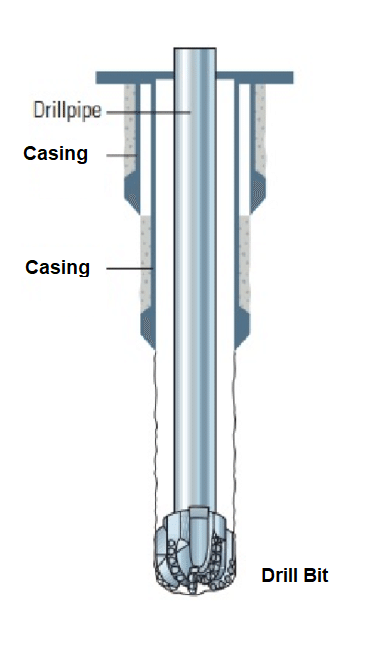
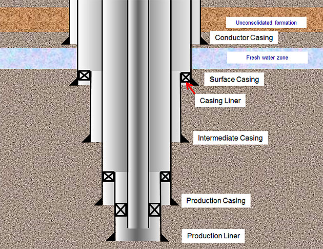
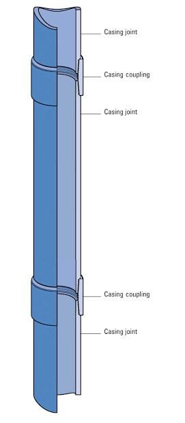

## Drilling and Completion

# Drilling:

A well is constructed from several different sections. In each section, the following main operations will typically take place:

   + A well is created by drilling a hole into the earth.
   + After that, a casing is run into the well to maintain borehole stability.
   + The casing then needs to be cemented into place.

<iframe width="700" height="480" src="https://www.youtube.com/watch?v=0SmSNRTU1Vw" frameborder="0" allowfullscreen=""> </iframe>

- <u>Hole Drilling</u>:

A hole is drilled with a drill string and a drill bit attached at its end. The OD of the drill bit determines the hole size.

During drilling operation, [drilling fluid](https://www.glossary.oilfield.slb.com/Terms/d/drilling_fluid.aspx) is pumped continuously into the hole to cool down downhole equipment and to bring [cuttings](https://www.glossary.oilfield.slb.com/Terms/c/cuttings.aspx) to surface for disposal.

{:class="img-responsive"}

- <u>Casing Running</u>:

Casing with sufficient strength is run into the drilled borehole to support the well. The followings are typical casing types in a well:

   + Conductor (shallowest setting casing string).
   + Surface Casing.
   + Intermediate Casing (multiple sections can have this type of casing).
   + Production Casing (deepest setting casing string, right at or above [reservoir](https://www.glossary.oilfield.slb.com/Terms/r/reservoir.aspx) interval / perforation zone).
   
A casing that is hung inside another casing is called a liner (the top of the liner does not extend to surface or [wellhead](https://www.glossary.oilfield.slb.com/Terms/w/wellhead.aspx)).

{:class="img-responsive"}

A casing string is constructed by connecting multiple casing joints together. The joints are connected at the couplings (connections) which have slightly larger OD than the casing.

{:class="img-responsive"}

- <u>Casing Cementing</u>:

{:class="img-responsive"}

# Completion:

- Well Logging
- Tubing Running
- Perforation
- Well Testing

Text [link text.](https://en.wikipedia.org/wiki/Deepwater_Horizon_explosion)

[back](./)
