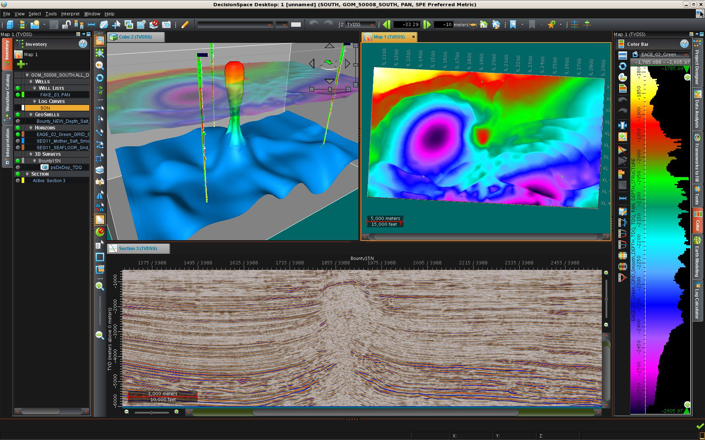

## G&G Software
Geology & Geophysics application are very useful tool for geologists and geophysicists to interpret seismic data, geological data, evaluate 
and prioritize prospects before drilling.
The list of G&G application is as below:
{: style="text-align: justify;"}
- [DecisionSpaceDesktop](https://www.landmark.solutions/DecisionSpace-Geosciences-10)

- [Petrel](https://www.software.slb.com/products/petrel)

- [Kingdom](https://ihsmarkit.com/products/kingdom-seismic-geological-interpretation-software.html)

G&G Product
{: style="text-align: center;"}
* * *
[Back](./upstream.html)
