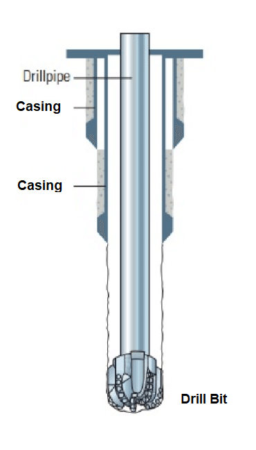
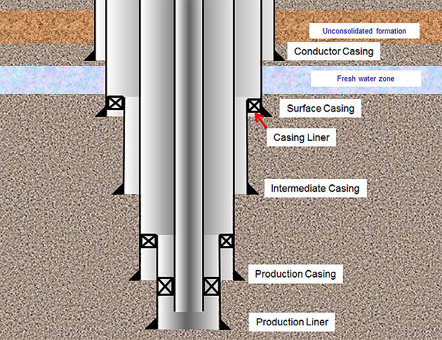
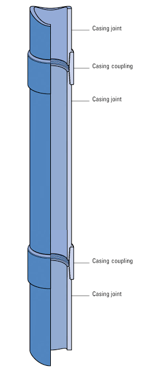
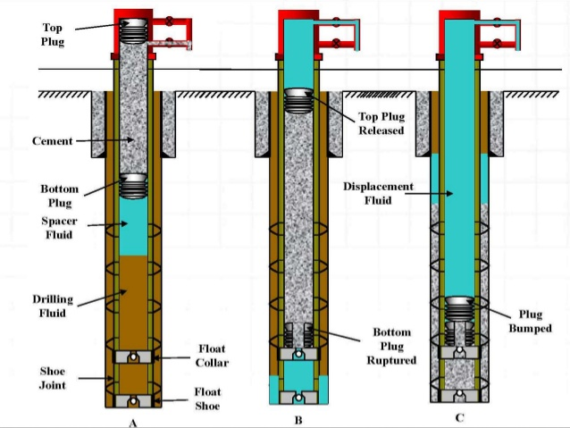

## Drilling

A well is constructed from several different sections. In each section, the following main operations will typically take place:

   - A hole is drilled into the earth.
   - A casing string is run into the borehole to maintain stability.
   - The casing is cemented into place.

### *<u>1. Hole Drilling</u>*

A hole is drilled with a [drill string](https://www.glossary.oilfield.slb.com/Terms/d/drill_string.aspx) and a [drill bit](https://www.glossary.oilfield.slb.com/Terms/d/drill_bit.aspx) attached at its end. The OD of the drill bit determines the hole size.

During drilling operation, [drilling fluid](https://www.glossary.oilfield.slb.com/Terms/d/drilling_fluid.aspx) is pumped continuously into the hole to cool down downhole equipment and to bring [cuttings](https://www.glossary.oilfield.slb.com/Terms/c/cuttings.aspx) to surface for disposal.

### *<u>2. Casing Running</u>*

Casing with sufficient strength is run into the drilled borehole to support the well. The followings are typical casing types in a well (from top to bottom):

   - Conductor (shallowest setting casing string).
   - Surface Casing.
   - Intermediate Casing (multiple sections can have this type of casing).
   - Production Casing (deepest setting casing string, right at or just above [reservoir](https://www.glossary.oilfield.slb.com/Terms/r/reservoir.aspx) interval / perforation zone).
   
A casing that is hung inside another casing is called a liner (the top of the liner does not extend to surface or [wellhead](https://www.glossary.oilfield.slb.com/Terms/w/wellhead.aspx)).

A casing string is constructed by connecting multiple casing joints together. The joints are connected at the couplings (connections) which have slightly larger OD than the casing.

### *<u>3. Casing Cementing</u>*

Cement is used to hold casing in place and prevent fluid migration among layers of rocks.

Cement slurry is pumped through the inside of casing and exits to the [annulus](https://www.glossary.oilfield.slb.com/Terms/a/annulus.aspx) through the casing shoe. To prevent contamination, a [bottom plug](https://www.glossary.oilfield.slb.com/Terms/c/cementing_plug.aspx) is dropped inside the casing before cement is pumped, and a [top plug](https://www.glossary.oilfield.slb.com/Terms/c/cementing_plug.aspx) is dropped when all slurry has been pumped.

A [spacer](https://www.glossary.oilfield.slb.com/Terms/s/spacer.aspx) is pumped before the slurry to clean out the inside of the casing and avoid contamination.

[back](../)
