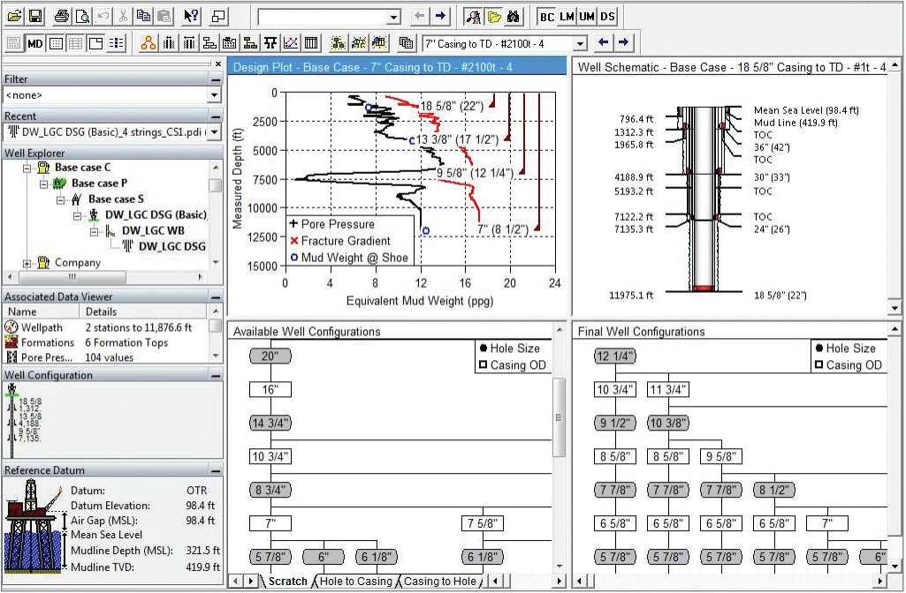
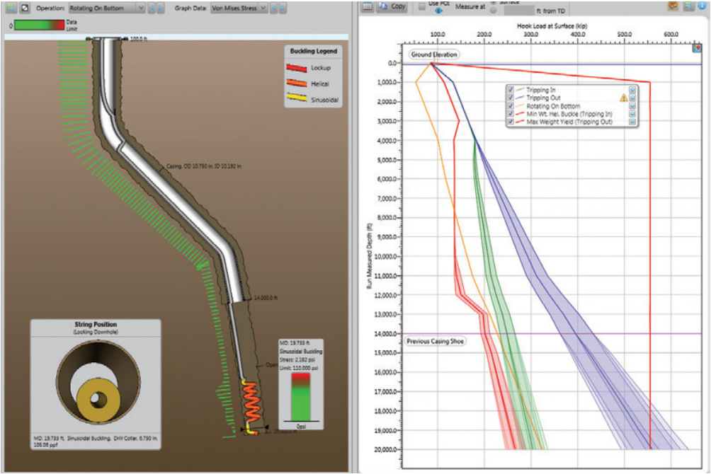
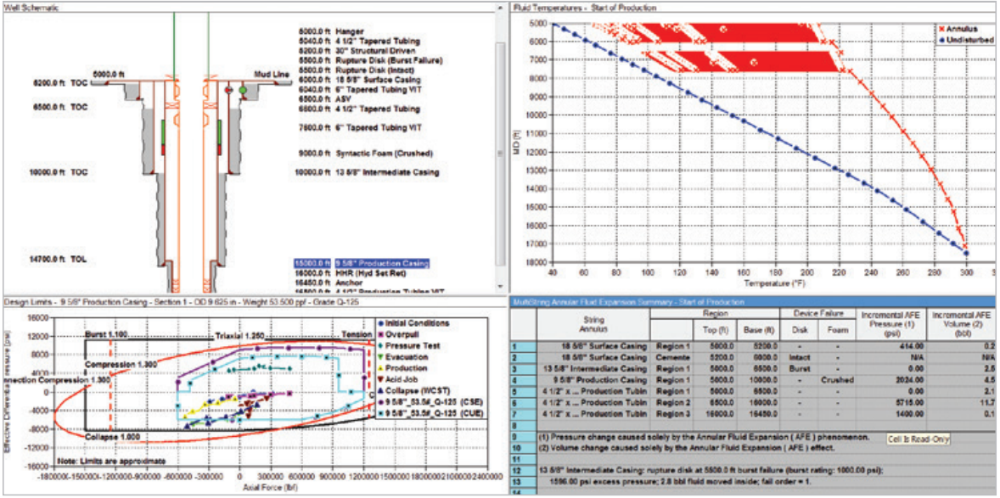

## Drilling Software

Halliburton Landmark Solutions include a number of Well Construction software packages that are commonly used by engineers and operators worldwide.

- [COMPASS](https://www.landmark.solutions/COMPASS-Directional-Well-Path-Planning): directional well path planning, survey data management, anti-collision analysis.

- [CasingSeat](https://www.landmark.solutions/StressCheck-CasingSeat): casing setting depth determination, viable casing and wellbore schemes.

- [WellPlan](https://www.landmark.solutions/WellPlan-Well-Engineering-Software): hydraulics, torque and drag, swab and surge, well control, stuck pipe, BHA dynamics, cementing and centralization design.

- [StressCheck](https://www.landmark.solutions/StressCheck-CasingSeat): casing design based on user-defined loads, casing wear limits, minimum-cost design solutions, comprehensive tri-axial design, working-stress design for burst, collapse, and axial installation and service-life loads.

- [WELLCAT](https://www.landmark.solutions/WELLCAT): wellbore analysis, casing and tubing design, temperature and pressure profiles, wellhead movement, annular pressure build-up.

- [OpenWells](https://www.landmark.solutions/OpenWells): comprehensive operations reporting, NPT and technical limit analysis.

[back](./upstream.html)
