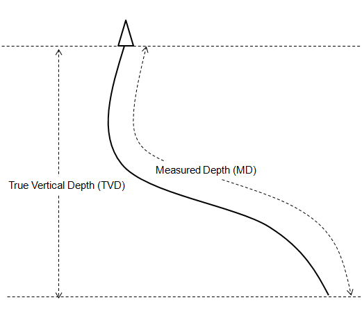
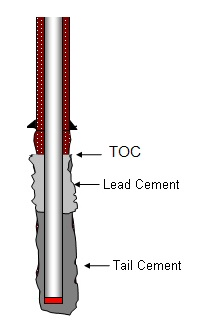
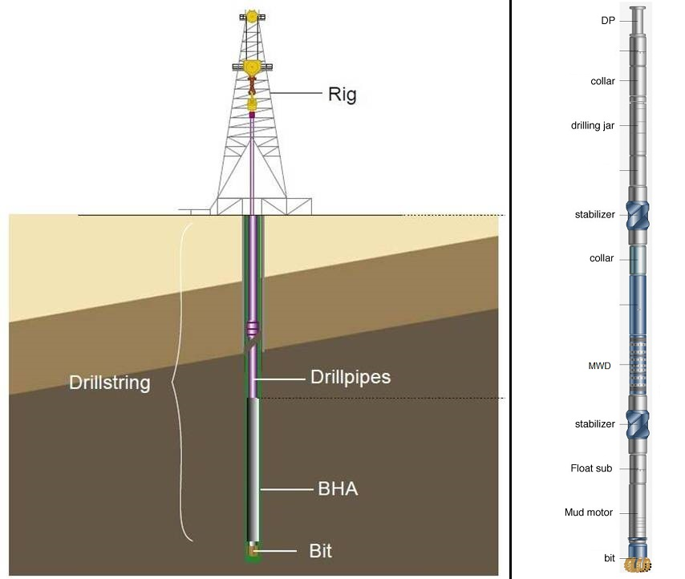

## Drilling

### TVD vs. MD

*Definition:*
- [TVD](https://www.glossary.oilfield.slb.com/Terms/t/tvd.aspx) (True Vertical Depth): vertical distance from top to bottom.
- [MD](https://www.glossary.oilfield.slb.com/Terms/m/md.aspx) (Measured Depth): distance along the borehole.

*Data Validation:*
- TVD is always less than or equal to MD.

### TOC, Lead and Tail Cement

*Definition:*
- After the cement job has been completed and slurry has entered the [annulus](https://www.glossary.oilfield.slb.com/Terms/a/annulus.aspx), the top of the slurry column is called TOC (top of cement).
- If 2 different slurries is pumped in the cement columnn (different density / weight):
   - The slurry that is pumped first (and therefore enters the [annulus](https://www.glossary.oilfield.slb.com/Terms/a/annulus.aspx) first and will be on top in the [annulus](https://www.glossary.oilfield.slb.com/Terms/a/annulus.aspx) after the cement job has been completed) is called "Lead Cement".
   - The slurry that is pumped after the "Lead Cement" (and therefore enters the [annulus](https://www.glossary.oilfield.slb.com/Terms/a/annulus.aspx) later and will be at the bottom in the [annulus](https://www.glossary.oilfield.slb.com/Terms/a/annulus.aspx) after the cement job has been completed) is called "Tail Cement".

*Data Validation:*
- TOC always lies between casing shoe and casing hanger.

### Drill String, Drill Pipe, BHA and Drill Bit

- Drill String:
- Drill Pipe:
- BHA (Bottom Hole Assembly):
- Drill Bit:

[back](../)
