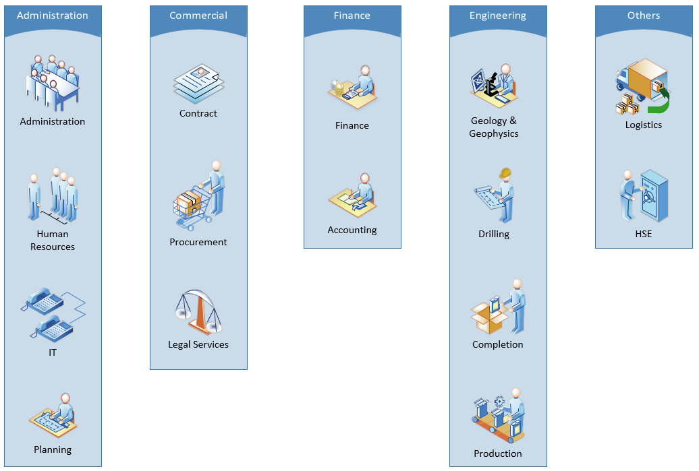

## Operator - Oil Company

In the oil and gas industry, an operator is the company responsible for the exploration, development, and production of an oil or gas well or lease. It hires service companies to carry out the work under its supervision and serves as the overall manager and decision-maker of a drilling project.

Generally, but not always, the operator will have the largest financial stake in the project. As far as the drilling contractor and service companies are concerned, the designated operator is paying for the entire operation, and the operator is responsible for recouping some of that expense from the partners.

Within an operator, engineering departments involve directly in the design and execution of exploration, development and production operations. Other functional departments provide supports throughout every project.

### Organization of a typical Operator - Oil Company

[back](../)
