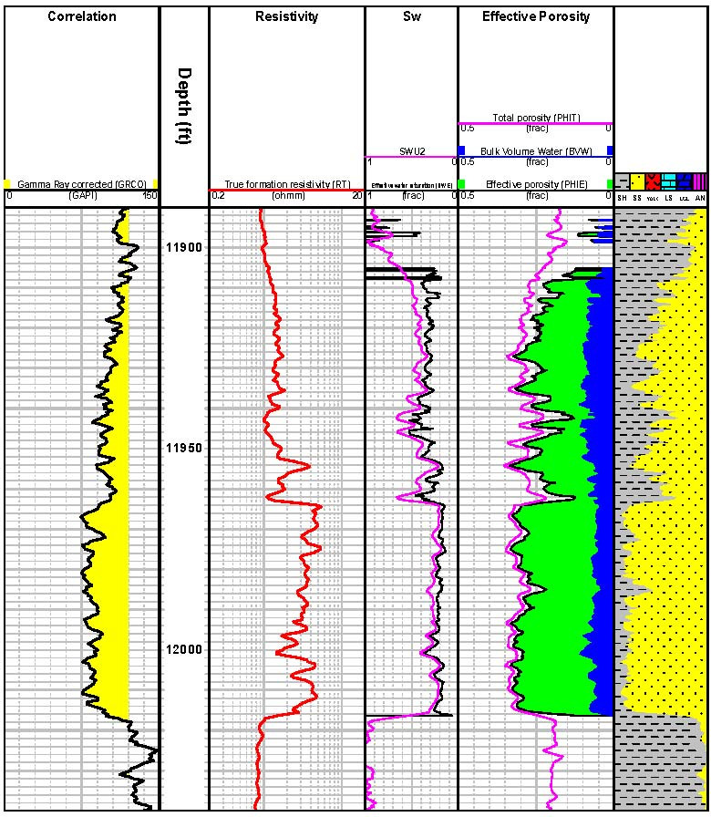

## Petrophysics and Petrophysical software

Petrophysics is the study of the physical and chemical properties of rocks and their contained fluids. The person who performs Petrophysics work is called Petrophysicist.

There is a large number of available petrophysical software, some of which are integrated, that is, they include software that work on other type of data too, not only Petrophysical data. Some of the most notable Petrophysics software packages are listed below.

### [Techlog](https://www.software.slb.com/products/techlog), by Schlumberger.

### [Interactive Petrophysics, IP](https://www.lr.org/en/ip/), a product of Lloyd's Register.

### [Geolog](http://www.pdgm.com/products/geolog/), by Emerson.

And many more software packages delivered by smaller company.

{: style="text-align: center;"}
_A typical Petrophysics log display_
{: style="text-align: center;"}

[back](./upstream.html)
