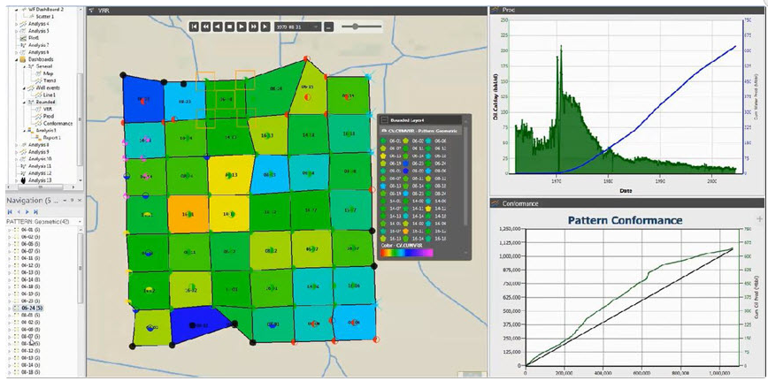
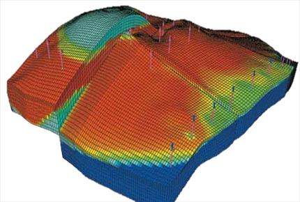
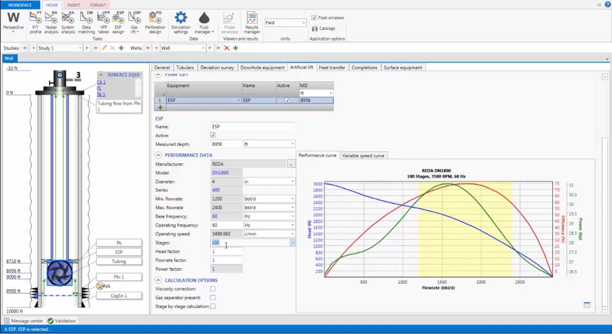
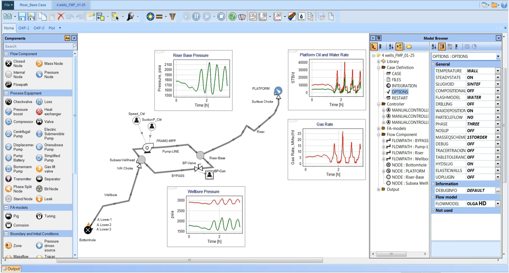
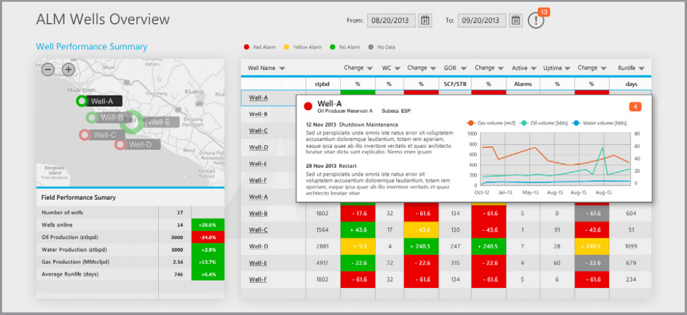

## Production & Reservoir Software

- [OFM](https://www.software.slb.com/products/ofm): surveillance and management of oil and gas fields, production and reservoir data analysis.

- [ECLIPSE](https://www.software.slb.com/products/eclipse): black oil, compositional, thermal, and streamline reservoir simulation.

- [PIPESIM](https://www.software.slb.com/products/pipesim): steady-state multiphase flow simulator, flow modeling, flow assurance.

- [OLGA](https://www.software.slb.com/products/olga): dynamic multiphase flow simulator, pipeline management.

- [Avocet](https://www.software.slb.com/products/avocet): production data management system, field-level decision support system.

[back](./upstream.html)
