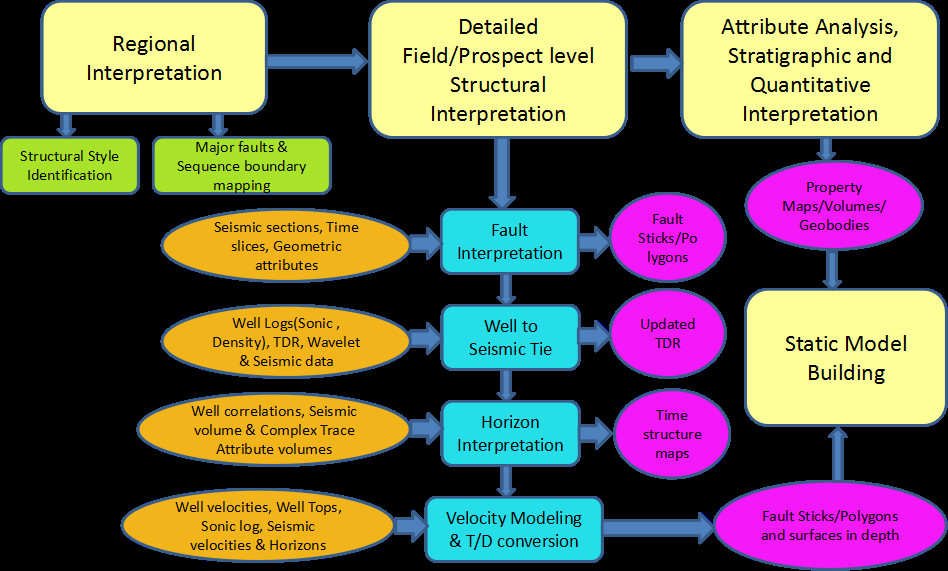
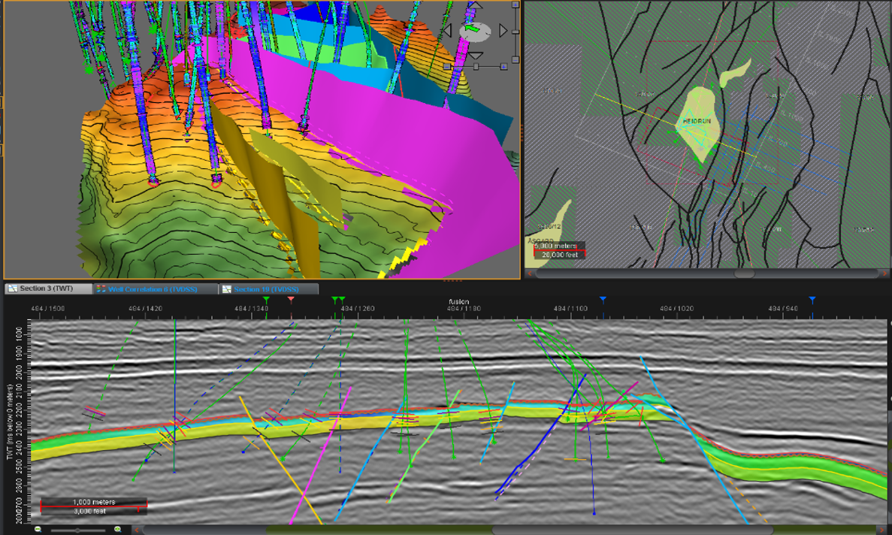

# Seismic Interpretation

The main goal of seismic interpretation is to utilize 2d seismic dataset or 3d seismic dataset in order to interpret some key horizons and fault systems and then generate depth structural maps (**Fig. 6**). 
Based on the result of interpretation, geophysicists and geologists will be analyzed geophysical and geological factors and defined where the hydrocarbon potentials are. Here is a basic workflow for seismic interpretation (**Fig. 5**).
{: style="text-align: justify;"}

**Fig.5:** Seismic interpretation workflow
{: style="text-align: center;"}

**Fig.6:** Seismic section
{: style="text-align: center;"}

For the more details, please visit a lecture [here](https://slideplayer.com/slide/703696/)
* * *
[Back](./geophysics.html)
