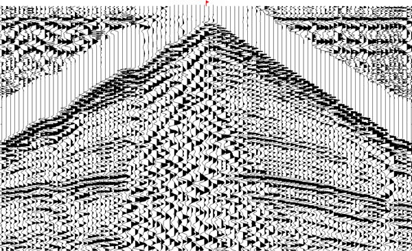
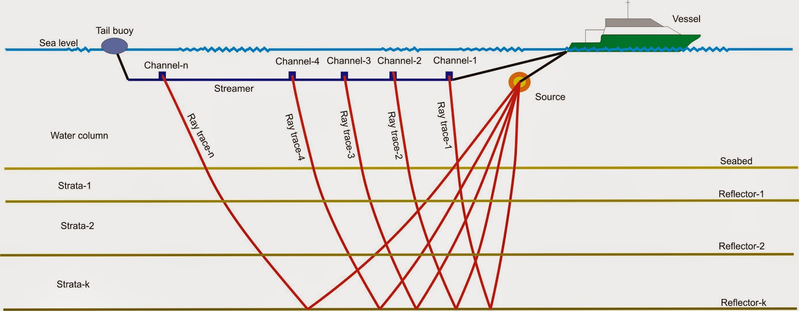
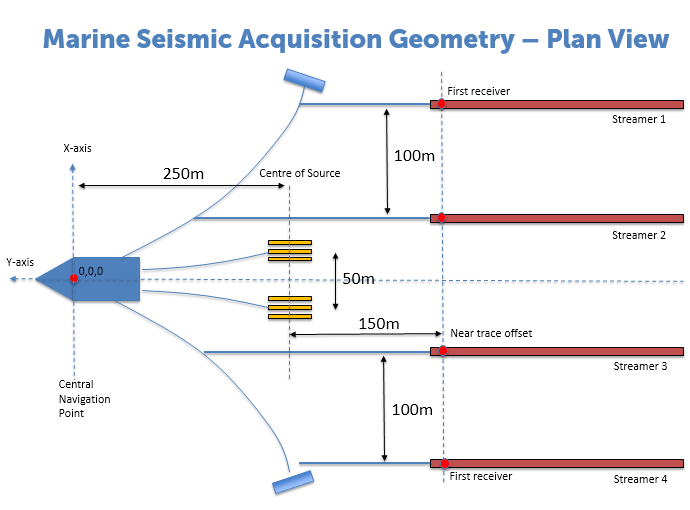

## Seismic Acquisition
The seismic survey is an essential part of the
whole cycle of petroleum exploration and production.
Seismic surveys are carried out on land and in transition
zone, shallow marine and marine environments in different ways.
The basic principle is an impulse
source such as dynamite, air-gun or vibrator that sends
acoustic energy into the Earth. This energy propagates
in many directions. Downward travelling energy
reflects and refracts when it encounters boundaries
between two layers with different acoustic properties
. Sensors or geophones placed on the surface
measure the reflected acoustic energy, converting
it into an electrical signal that is displayed as a seismic
trace. Read more about it [here.](http://www.parkseismic.com/Whatisseismicsurvey.html)
{: style="text-align: justify;"}

Seismic traces
{: style="text-align: center;"}

Seismic acquisition can be performed both on land and in marine environments by using [2D](https://www.youtube.com/watch?v=1iR20AUGzeo) or [3D](https://www.youtube.com/watch?v=sWtymRNbqaE) seismic method.
{: style="text-align: justify;"}

2D Seismic Design
{: style="text-align: center;"}

3D Seismic Design
{: style="text-align: center;"}
* * *
[Back](./upstream.html)