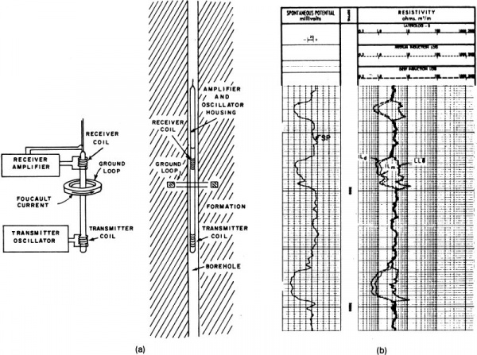
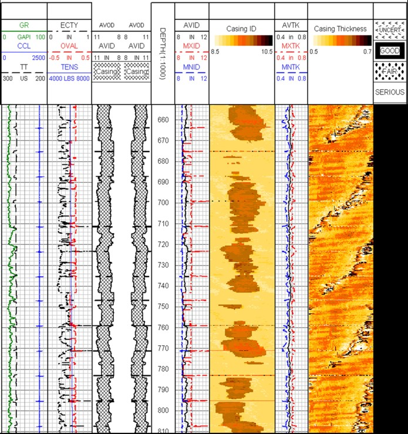
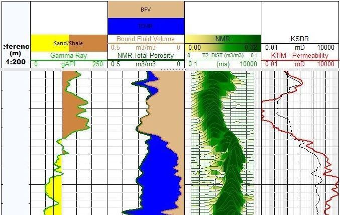

## Logging - Wireline

Drilling the well alone won’t tell us if there is any oil and gas underground.

Well logging is the practice of making detailed record of the properties of the rock and fluids of the downhole reservoir. It is required to understand the oil and gas potential of the well. Well logging can be done while drilling, called ["Logging While Drilling"](../subpages/lwd.html) (also called "Measurement While Drilling") or by [Wireline](../subpages/wireline.html).

Wireline logging is performed by lowering a "logging tool" - or a string of one or more instruments - on the end of an electrical cable (wireline) into the well and recording downhole data. This data is then analyzed by a specialist (most of the time the Petrophysicist), and the resulting intepretation is used to assess the economic viability of the oilfield.

{: style="text-align: center;"}
_Simple diagram of a Wireline job in action_
{: style="text-align: center;"}

Wireline logging is usually done by services company. Services company may offer one or more of different logging tool, each contains sensors that measure a specific set of data.

There are a wide range of technologies employed by wireline logging. Brief information on some of them are listed below.

* Radioactive logs
* Electrical logs
* Acoustic (sonic) logs
* Mechanical logs and tools
* Nuclear Magnetic Resonance logs

### Radioactive logs

The radioactive type logging tools measure the naturally occurring or induced radioactivity of the downhole formation (rock and fluid). The information is then analyzed to derive lithology content, density or porosity of the rock. There are three main type of radioactive logs: natural gamma ray, density using induced gamma ray, and porosity using neutron.

#### *Natural gamma ray*

This tool measures the naturally occured gamma ray activity in the rock. Gamma ray in nature is produced by three main element: thorium, potassium and uranium. The sum of all three gamma ray activities (total gamma ray) is used to indicate how much shale are there in the rock, while individually they indicate the kind of shale presences. 

Note that conventionally, shale are rock that do not contain producible oil or gas. The exception being oil/gas shale, as in [unconventional oil/gas.](https://en.wikipedia.org/wiki/Shale_oil)

{: style="text-align: center;"}
_A log display with total and individual gamma ray_
{: style="text-align: center;"}

Besides being used as lithology tool, gamma ray log is also used as correlation log between different record of the same well, or between wells.

#### *Density log*

Density tool uses a strong chemical gamma ray source and bombards the formation with high energy gamma ray. The sensors in the tool measure the interaction of the gamma with the formation to determine its density.

Density tool is often fitted with a mechanical arm to help forcing the measuring pad to be closer to the borehole wall. This arm (also called "caliper") is also used to measure the size of the hole.

{: style="text-align: center;"}
_A density tool with pad and opened caliper_
{: style="text-align: center;"}

With some assumption about the type of fluid in the formation and its density, density log can be used to derive porosity.

#### *Porosity log*

Porosity of a formation is the amount of space filled with fluid in the rock. Porosity is important information because it shows if the rock may contain oil or gas.

Porosity log is commonly measured using neutron tool. This tool uses chemical neutron source, or electrically generated neutron source(called Pulsed Neutron). The neutrons enter and interact with the formation, the recorded data is used to derive the formation's porosity.

{: style="text-align: center;"}
_Diagram of a simple neutron tool with source and two detectors_
{: style="text-align: center;"}

### Electrical logs

The first log ever recorded in the history of the oil and gas industry was an electrical log. Electrical log mainly measures the electrical resistivity of the formation. 

There are two main type of electrical logs: resistivity log and borehole imaging log.

#### *Resistivity log*

Resistivity tools use electrodes that expose to the wellbore and inject electrical current into the formation. The tools have many electrodes that also measure the returned signal after they have traveled through the formation. 

The acquired signal is processed to produce the resistivity information of the rock and its fluid. Hydrocarbon (Oil and Gas) do not conduct electricity and hence rocks filled with hydrocarbon would have a higher resistivity value.

{: style="text-align: center;"}
_Diagram of a simple resistivity tool with one each transmitter - receiver_
{: style="text-align: center;"}

#### *Borehole imaging*

Borehole imaging tools use tiny electrode packed together to produce resistivity image of the wellbore. This image is "normalized" to increase the contrast between different parts of the wellbore so it can be intepreted easier.

The wellbore image is used to detect fractures or other geological features of the well.

{: style="text-align: center;"}
_A fullbore imaging tool_
{: style="text-align: center;"}

{: style="text-align: center;"}
_The image produced by a fullbore imaging tool_
{: style="text-align: center;"}

### Acoustic (Sonic) logs

Acoustic and sonig logging tools use sound wave at different frequencies to measure various properties of the formation. One of those is called "formation slowness", it is the time it takes for sound to travel a unit of distance in the rock. Acoustic/sonic logging method is also used to measure the inside of the wellbore, and produce an image similar in use to the one produced by the resistivtiy method.

{: style="text-align: center;"}
_Simple diagram of a 2 transmitters, 4 receivers sonic tool_
{: style="text-align: center;"}

One of the key application of acoustic/sonic logging is to evaluate the quality of the casing's cement. It is also used to detect internal and external condition of the casing or tubing.

{: style="text-align: center;"}
_A corrosion log of a ultra-sonic imaging tool_
{: style="text-align: center;"}

### Mechanical logs and tools

Logging tool may have mechanical arms that measure the internal diameter of the wellbore, produce "caliper" log. Simple caliper log may come from a single arm tool, while multi-finger tool will produce detail caliper "image" of the inside of the well for casing or tubing damage assessment, where acoustic corrosion tool is restricted due to its size.

{: style="text-align: center;"}
_A caliper log showing the hole profile_
{: style="text-align: center;"}

{: style="text-align: center;"}
_Multi-finger tool use for assessing internal casing and tubing damage_
{: style="text-align: center;"}

Other tools have drill bit, pressure sensor, pump and downhole containers to collect and capture rock samples, or formation fluids for further analysis.

{: style="text-align: center;"}
_A pressure and sample collection tool in action_
{: style="text-align: center;"}

{: style="text-align: center;"}
_The drill bit of a mechical sidewall coring tool, with the core in its shaft_
{: style="text-align: center;"}

### Nuclear Magnetic Resonance 

Nuclear Magnetic Resonance (NMR) tool utilizes the physical phenomenon that a nuclei in a strong static magnetic field are perturbed by a weak oscillating magnetic field. This results in a weak electromagnetic signal that can be detected and used to characterize various properties of downhole rock and fluid.

In the oilfield, the nuclei in focus is the hydrogen nuclei. As hydrogen is present in both water and hydrocarbon, knowing how much hydrogen is there is nearly equal with knowing how much fluid is there in the rock.

The same NMR principle is used in the health care industry with the MRI machine (Magnetic Resonance Imager).

Nuclear Magnetic Resonance is complex science. To better understand this principle, please first watch this series of NMR training video by the late Dr. Paul Callaghan on youtube at this [link](https://www.youtube.com/watch?v=7aRKAXD4dAg&t=1s).

A very good explanation of NMR logging technology can be found [here](https://petrowiki.org/Nuclear_magnetic_resonance_(NMR)_logging).

{: style="text-align: center;"}
_Typical display of a NMR log_
{: style="text-align: center;"}

[back](./upstream.html)